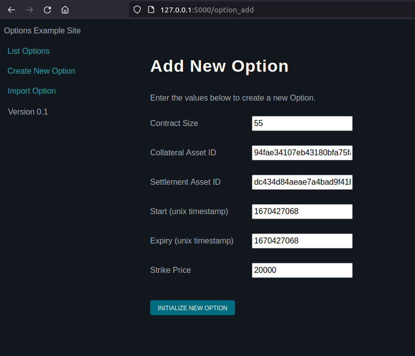
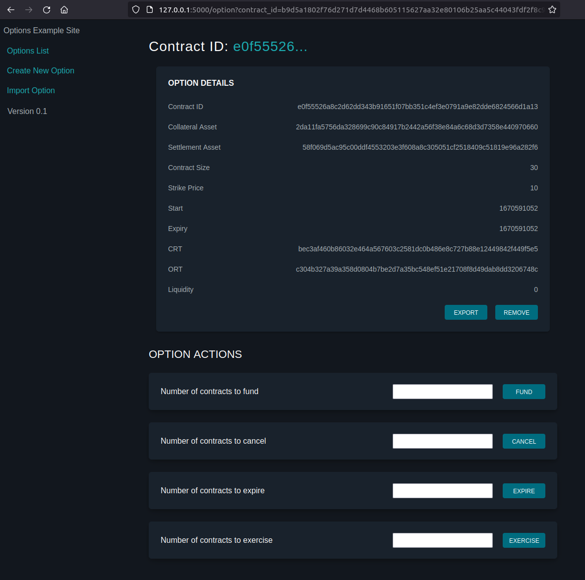
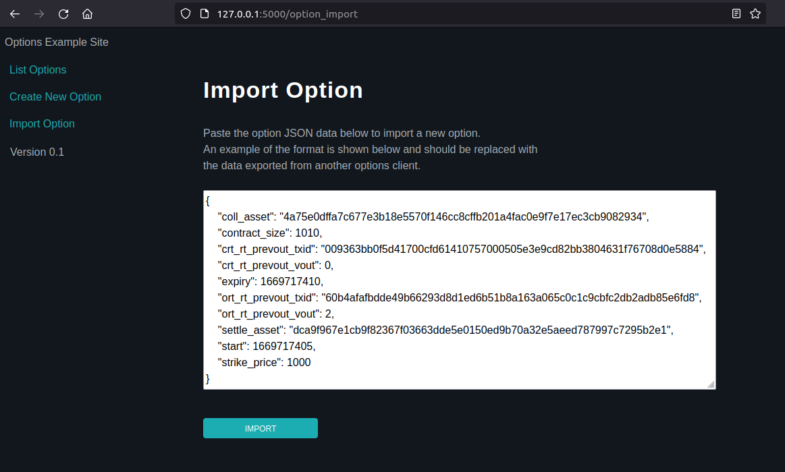
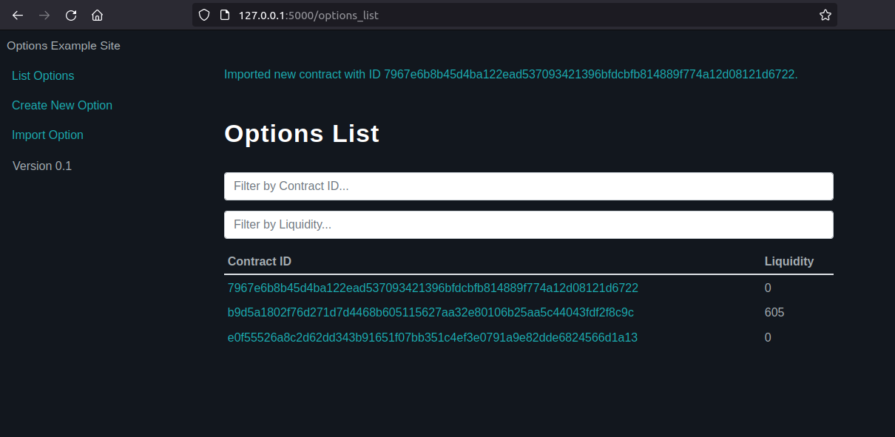

# Flask Options Example Website

Example website that uses the [associated example HTTP API](https://github.com/wintercooled/flask_options_example_api) to access the Liquid Options Client.

This is an example front end and can be replaced with any front end that can make API calls including JavaScript etc.

Nothing goes in here apart from calls to the API and displaying returned data - all saves to dtabase or calls to other APIs etc should go in the API that serves this website.

It is not intended to be an example of how to deliver a brilliant Flask API - so pardon any bad practices ;-)

## Example Website









## How to Run
```
virtualenv -p python3 venv

source venv/bin/activate

pip install -r requirements.txt
```

To run the website (the API will use its own port so you can set the port to anything but the API port):

```
flask run --port <port-here>
```

As the flask_template_api uses port 5001 we'll use 5000:

```
flask run --port 5000
```

Then visit the local site at http://127.0.0.1:5000

PLEASE NOTE A LOT OF THE CSS AND IMAGES ETC CAN BE CLEARED OUT - THEY HAVE NOT BEEN CLEANED AND WILL CONTAIN REDUNDANT ELEMENTS

## Developer Reference

If you are using Visual Studio Code you can use the following as the launch.json within .vscode and then step through the code and add breakpoints etc:

```
{
    "name": "Python: Flask",
    "type": "python",
    "request": "launch",
    "module": "flask",
    "env": {
        "FLASK_APP": "app.py",
        "FLASK_DEBUG": "0"
    },
    "args": [
        "run",
        "--no-debugger",
        "--no-reload",
        "--port",
        "5000"
    ],
    "jinja": true,
    "configurations": [
        {
            "name": "Python: Flask",
            "type": "python",
            "request": "launch",
            "module": "flask",
            "env": {
                "FLASK_APP": "app.py",
                "FLASK_DEBUG": "1"
            },
            "args": [
                "run",
                "--no-debugger",
                "--port",
                "5000"
            ],
            "jinja": true
        }
    ],
}
```
